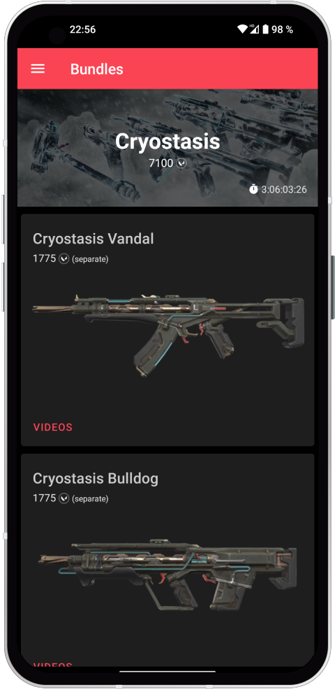

<h1>VShop for Valorant</h1>

VShop allows you to check your Valorant Store, Night Market, Profile and more. It runs entirely on your device and securely transmits your credentials to the official Riot Games servers (more information in our <a href="https://docs.vshop.one/security">docs</a>).
 
 

  
  

## Translations
VShop is available in 16 different languages. The translations files are available in [VShopApp/translations](https://github.com/VShopApp/translations), which is synced with [weblate](https://weblate.vasc.cloud).

## Credits
This app would not have been possible without the following projects:
- [valorant-api-docs](https://github.com/techchrism/valorant-api-docs) - Unofficial Valorant API documentation
- [valorant-api.com](https://valorant-api.com) - In-Game assets

I would also like to thank all of our translations and other projects members, which are listed on the [credits page](https://vshop.one/credits) 💖
